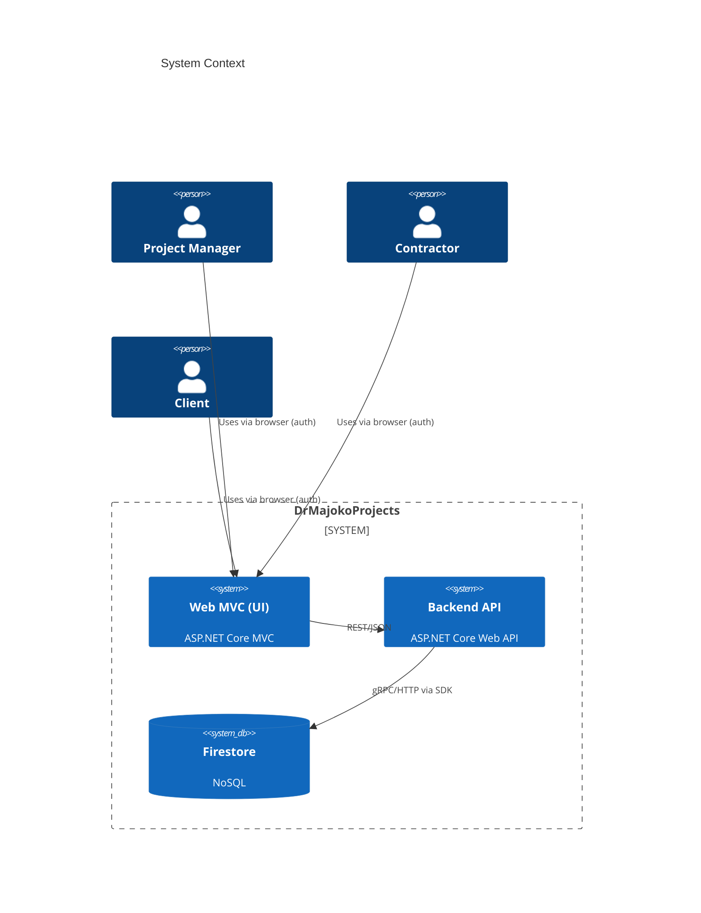
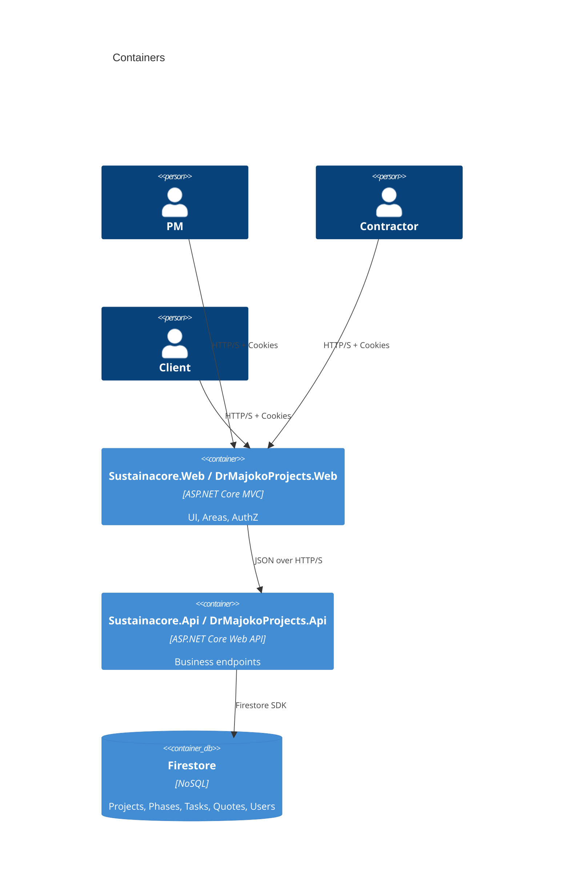
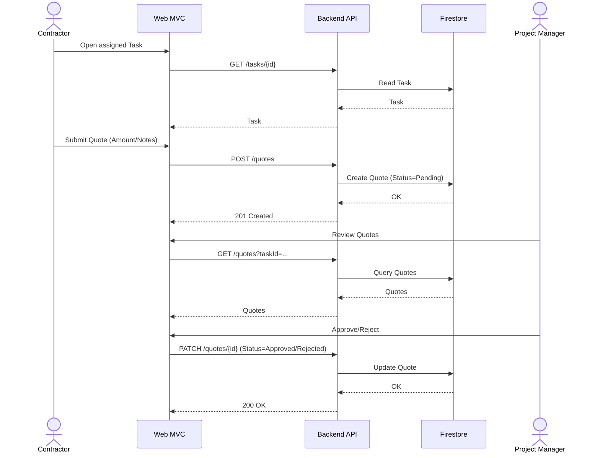
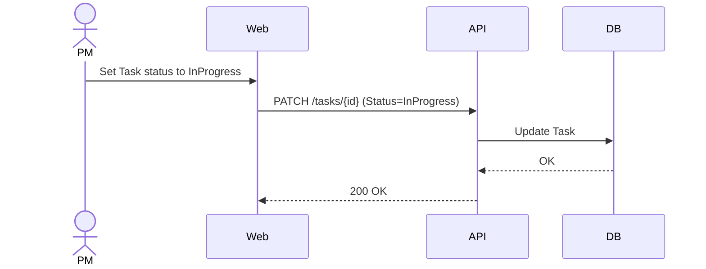
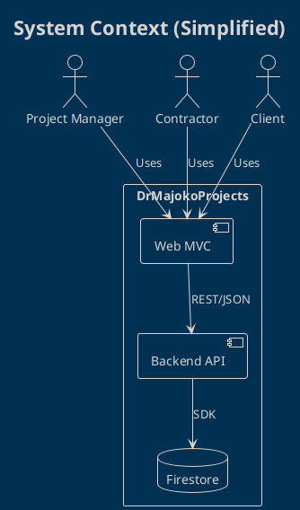

# System Design — DrMajokoProjects

**Version:** 1.0  
**Date:** 2025-11-03

## 1. Overview
DrMajokoProjects is a project & contractor management platform aligned to the academic POE. It provides role-based portals for Project Managers, Contractors, and Clients, with a quote lifecycle and progress tracking. The system is built on ASP.NET Core (Web MVC + Web API) with Firebase Firestore as the initial data store.

## 2. Goals & Non‑Goals
- **Goals**
  - Support projects → phases → tasks hierarchy
  - Contractor task assignment and quote submission per task
  - PM quote approval/rejection and audit trail
  - Client progress visibility and rating
  - Secure, role-based access; cloud-friendly
- **Non‑Goals (for MVP)**
  - Complex procurement/PO workflows
  - Real-time notifications
  - Advanced cost forecasting

## 3. High-Level Architecture (C4-Style)


### Containers


## 4. Core Domain Model (ERD — logical)
```mermaid
erDiagram
  USER ||--o{ USERROLE : has
  ROLE ||--o{ USERROLE : granted

  PROJECT ||--o{ PHASE : contains
  PHASE ||--o{ TASK : contains
  TASK ||--o{ QUOTE : requests
  USER ||--o{ QUOTE : "submitted by Contractor"
  USER ||--o{ PROJECT : "PM owns/assigned"
  PROJECT ||--o{ DOCUMENT : "shared docs"

  USER {
    string UserId PK
    string Email
    string DisplayName
  }
  ROLE {
    string RoleId PK
    string Name
  }
  USERROLE {
    string UserId FK
    string RoleId FK
  }
  PROJECT {
    string ProjectId PK
    string Name
    string ClientName
    decimal Budget
    string Status
    date StartDate
    date EndDate
  }
  PHASE {
    string PhaseId PK
    string ProjectId FK
    string Name
    decimal Budget
    int SortOrder
  }
  TASK {
    string TaskId PK
    string PhaseId FK
    string Name
    string Description
    string Status
    decimal EstHours
    decimal ActualHours
    string AssigneeId
    int SortOrder
    date EstStart
    date EstEnd
  }
  QUOTE {
    string QuoteId PK
    string TaskId FK
    string SubmittedBy FK
    decimal AmountExcl
    decimal VAT
    decimal Total
    string Status
    date SubmittedAt
    date? DecidedAt
    string? DecisionBy
    string? Notes
  }
  DOCUMENT {
    string DocumentId PK
    string ProjectId FK
    string FileName
    string Url
    string Visibility  // client|contractor|internal
    date UploadedAt
  }
```

## 5. Sequence Diagrams

### 5.1 Quote Lifecycle


### 5.2 Task Status Update


## 6. Firestore Data Design (Collections)
- `users/{userId}`: profile, roles (denormalized list)
- `projects/{projectId}`: meta
  - `phases/{phaseId}`
    - `tasks/{taskId}`
      - `quotes/{quoteId}`
  - `documents/{documentId}`

Recommended composite indexes:
- `quotes` by `taskId, status`
- `tasks` by `assigneeId, status`
- `projects` by `ownerId, status`

## 7. Security
- Cookie Auth (server-side) + role-based authorization per Area (ProjectManager, Contractor, Admin)
- Enforce HTTPS, secure cookies, anti-forgery tokens on form posts
- Principle of least privilege for Firestore service account
- Secrets via `dotnet user-secrets` in dev; never commit credentials

## 8. Deployment Topology
- **Local**: Web + API run on localhost (different ports)
- **Cloud**: Container-ready; API and Web can be separate services behind HTTPS
- CI builds and runs tests on PRs; optional deploy job can be added later with environment protection rules

## 9. Observability
- ASP.NET logging (structured) with Console provider
- Correlation IDs via middleware
- Future: OpenTelemetry exporters

## 10. Screenshots (Mocks)
Below are mock screenshots for documentation purposes. Replace with real screenshots when UI is finalized.


## 11. Appendix: PlantUML Versions
For teams preferring PlantUML, equivalent diagrams can be generated by copying the Mermaid logic.
